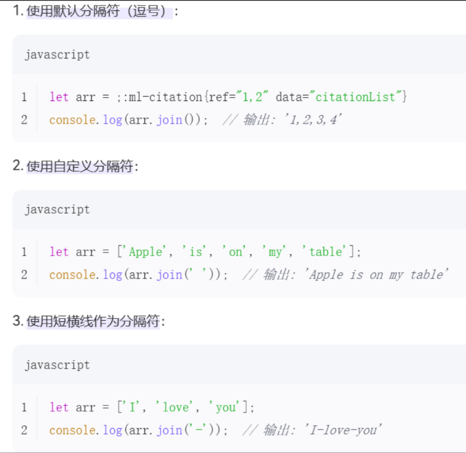
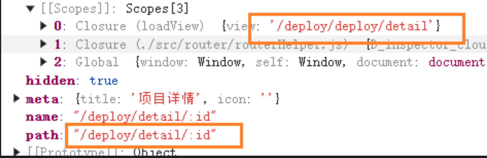

## Midea

- 可卸载信息，卸载列表的选择框显示
  - 通过定义好的[-2,-1,0,100]
    - 这里的 0 初始化，卸载失败 所以在卸载失败的时候查看会有问题
- 部署版本默认最新的是依据 publishStatus 字段是否为 1 来显示的 fix 版本
- guide 流程

  - 获得系统变量

  ```js
  const resSys = await getSysConfs({
    env: this.deploy.envCode,
  });
  ```

  - 在 result 中先导入所有的配置到 state 中(对应的 label，name)

  ```js
  const resMeta = await getMetaConfs({
    deployId: de.id,
    env: de.envCode,
  });
  this.setMetaConfs(resMeta);
  ```

  - 填写配置中的 ProductConfs，获得实际配置项，对实际配置项中的数据进行调整
    - 字符串数字改为数字
    - 如果 state 中的配置中又对应的产品 code
      - 将会(从 state 中获取到的数据)对应的 type 和 globalSingleton 赋值给这个产品

  ```js
  resProducts.forEach((p) => {
    for (const key in p.confs) {
      p.confs[key] = this.convertToObj(p.confs[key]);
    }
    if (this.metaConfs[p.code]) {
      p.type = this.metaConfs[p.code].type;
      p.globalSingleton = this.metaConfs[p.code].globalSingleton;
    }
    // p.isAddConf = false
  });
  ```

- 在 deploy 执行阶段

  - deploy 的值是从 state 中获取的，deploy/get 接口
    - 显示三个按钮操作 0 1 100 三种状态来进行显示

- 在新增部署的时候，对于数据进行处理，对于每个 select 选项能够又 formVersion 进行获取值

- 部署组件中默认选中最新版本的逻辑
  - 选中第一个 publishStatus 为 1 的版本
  - 像 publishStatus 为 1 并且更新时间为最新
    - 但是更新时间最新，又不想它是默认的
      - 原因是有个 99 排序

## 提升

- 封装组件

  - @click.stop 阻止事件冒泡
    - 点击事件不会冒泡到父元素中，并且这个父元素也有一个点击事件处理器，使用后可以防止点击按钮的时候触发父元素的方法
  - 插槽的使用

- javaScript
  - slice
    - 有返回值
  - splice
    - 在当前的数组里进行修改
  - forEach
    - 不会返回布尔值，而是返回 undefeind，使用 some 或者 every
  - indexOf
    - 适合普通数组
  - fineIndex
    - 需要一个回调函数作为参数，而不能是一个值，一个对象

## 术语

- currentPage 当前页面

## IDEA

- 设置格式化，vetur，在 settings 中 Editor:Default Formatter，选中

## CMS

- 内部链接和外部链接
  - 通过 app-link 组件来跳转
    - a 标签
    - roter-link
- 多级菜单

  - 模板
    - 组件
      - 函数式组件 render
  - n 级菜单
    - 递归渲染

- iframe
  - @load 加载完成后

# 10.27

## require 和 import 的区别

### 加载时机

- import 是在编译时加载的，必须放在文件的开头
- require 是在运行时加载的，可以放在代码的任何位置

### 所属规范

- import 是 ES6（2015）引入的关键字，属于 ES 模块化语法规范 -- 俄国十月革命（11）
- require 是 CommonJS 规范的一部分，主要用于 Node.js 环境

### 动态绑定

- import 提供静态分析，支持宏和类型检验
  - 宏 预处理指令
- require 提供动态绑定，更适合服务器或浏览器环境

### 导入值的修改

- import 导入的对象值被修改时，源对象也会被修改，相当于深拷贝
- require 导入值被修改的时候，源对象不会被改变，相当于浅拷贝

### 使用区别

- import

  - 需要在文件夹中添加 package.json 文件

  ```js
  {
    "type": "module"
  }
  ```

```js
const tree = {};

// 第一种
export default tree;
// 第二种
export { tree };
```

```js
import xx from "";
```

- require

```js
const tree = require("");
```

## 返回上一页保留查询条件

### 同一个页面切换不同视图，单页面中查询后点击详情，返回上一视图不想丢失查询条件

- vuex
- sessionStorage
- keep-alive

## element

### select

- 标签绑定的字段跟 option 绑定，修改绑定的值，自动就去会去修，不用修改 option 的值

### date-picker

- 使用 element ui 的 date-picker 组件，当使用了 disable 属性后，关闭这个属性再打开会没有值显示标签绑定的字段跟 option 绑定，修改绑定的值，自动就去会去修，不用修改 option 的值
  - 在 blur 事件使用 this.forceUpdate

### collapse

- 默认展开
  - 在 collapse 中 v-model 绑定一个值，在 collapse-item 中的 name 绑定同一个值

### table

- render-header：列标题 Label 区域渲染使用 Function 函数

  ```js
  <!-- 显示一个必填选项 -->
  addRedStar(h, { column }) {
      return [
        h("span", { style: "color: red" }, "*"),
        h("span", " " + column.label),
      ]
    },
  ```

- table 实现多选
  - select 单写一个 table-column
- default-active

  - 默认激活菜单的 index

- 固定高度

  - height 属性

- 间隔颜色

  - stripe

- 顶部颜色

```css
:header-cell-style="{
  background: '#F6F6F6',
  color: '#161C24',
  fontSize: '12px',
}" ;
```

- 添加加载动作

```html
<table
  v-loading="loading"
  element-loading-text="拼命加载中"
  element-loading-spinner="el-icon-loading"
  element-loading-background="rgba(0, 0,0, 0.8)"
></table>
```

### menu

- template #title（顶级菜单）
  - el-menu-item （次级菜单）
- 对于次级菜单，改变样式的时候，需要定义好相同的颜色，否则会出现闪烁的情况
- 左侧菜单占满整列，样式设置 height:100vh

  - 如果页面还有 header 组件，则需要凑合两者，使得两者之和为 100vh

- 封装 menu
  - 使用 ts
  - RouteRecordRaw 是 vue router 中的一个类型，用于定义路由记录的原始匹配对象

```js
// RouteRecordRaw 是 vue router 中的一个类型，用于定义路由记录的原始匹配对象
import { RouteRecordRaw } from "vue-router";

interface Props{
  routes:readonly RouteRecordRaw[]
}
```

- 菜单默认打开

```js
:default-openeds ="activeOpends"

const activeOpends = computed(()=>{
  return routes.value.filter(item=>{
    return item.children && item.children.length >0
  }).map(i=>i.path)
})
```

```css
.md-menu .md-menu-item {
  color: black !important;
  background: white !important;
}
.md-menu .md-menu-item.is-active {
  color: #2e95fb !important;
  background: white !important;
}
.md-sub-menu .md-sub-menu__title {
  color: black !important;
  background: white !important;
}
.md-sub-menu .md-sub-menu__title + .md-menu--inline .md-menu-item.is-active {
  color: #2e95fb !important;
  background: white !important;
}
```

- sidebar 在 table 使用的时候会被遮挡
- 自带设置 overflow hidden

```js
.md-scrollbar {
  /* 解决在hostManagement的时候，table必须要设置宽度 */
  overflow: visible;
}
```

- 对于菜单组件需要一直有个布局，要设置一个 chidren，其他都放在 children 里面
- 面包屑，不显示一个值，多增加一个变量 breadcrumb

### el-main

- 能够将主要区域都设置为一个整体，自适应剩下的区域

### el-upload

- before-upload
  - 如果返回的是 true，则是直接上传

### Message

```js
this.$message({
  message: `插件名称：${name} 不能重复`,
  type: "error",
  duration: 5000,
});
```

### makeDropDown

- 使用的时候，如果是有循环的话，在$dropdown 里面设置对应的标签，而不是在标签里再进行循环

```js
<template #dropdown>
  <template v-for="(subDropdown, subIndex) in mddropdowns" :key="subIndex">
    <template v-if="subDropdown.envs.length === 1">
      <md-dropdown-item @click="chooseEnv(subDropdown.envs[0].env, subDropdown.projectName)">
        <span style="width: 50px;">【{{ subDropdown.envs[0].env }}】</span> {{ subDropdown.projectName }}
      </md-dropdown-item>
    </template>
    <template v-else>
      <template v-for="items in subDropdown.envs" :key="items">
        <md-dropdown-item @click="chooseEnv(items.env, subDropdown.projectName)">
          <span style="width: 50px;">【{{ items.env }}】</span>{{ subDropdown.projectName }}
        </md-dropdown-item>
      </template>
    </template>
  </template>
</template>
```

### 默认打开开启

- 父组件添加 v-model，子组件添加 name，这两个的值对应要一样的

### 卸载列表同步

```html
<el-collapse v-model="itemFlag" />
<el-collapse-item name="1" />
itemFlag = ['1']
```

## 强制刷新

### this.$foreUpdate

- 某些情况下，即使数据发生了变化，组件的视图可以不会自动更新

  - 异步更新
  - 替换整个对象或数组，用新的对象或数组替换原来的对象或数组

- 强制组件更新
- 处理非响应式数据

  - 直接修改对象或数组的属性，该属性不是通过 Vue.set 方法添加的，无法检测这些变化

- 触发生命周期钩子函数

  - beforeUpdate 和 update

- 影响性能表现

  - 会跳过 vue.js 的性能优化机制

## 执行函数和立即执行函数

```js
const dfs = () => {};
const dfs = () => {};
```

- 第一种是立即执行函数，dfs 会被赋值，值为这个函数的返回值
  - 创建一个独立的作用域，避免变量污染全局作用域
- 第二种是箭头函数表达式
  - 没有 argument
  - 没有自己的 this
    - 箭头函数不会创建自己的 this 对象，只会继承在自己作用域的上一层 this
  - 不能修改 this 指向
  - 没有 prototype 属性
  - 不能作为构造函数
    - 没有 this，没有 prototype 属性
    - new 内部的实现
      - 创建一个新的空对象
      - 设置原型，将原型的对象设置为函数的 prototype 对象
      - 让函数的 this 指向这个对象，执行构造函数的代码
      - 返回新的对象

## 树

### 二叉树

- 使用 Object 模拟

### 完全二叉树

- 二叉树中，除了最后一层节点，其他都为满二叉树

# 10.28

## 事件总线 eventBus

- 向外导出 Vue 实例

  - 规定好数据的收发方

  ```js
  Bus.$on;
  Bus, $emit;
  ```

- 引入 mitt 库，向外导出

```js
import mitt from "mitt";
const eventBus = mitt();
export default eventBus;
```

## excel 表格导出

- 其实后端就能单独实现

# 10.29

## 计算属性名语法

- 以一个对象的属性作为另一个对象的键和值

```js
const xx = {
  [obj.name]: obj.key,
};
```

## v-model 和:model 区别

- v-model 是 v-model:value 的缩写
  - 可以实现数据双向动态绑定
- :model 是 v-bind:model 的缩写
  - 数据只能从父组件传递给子组件，但是子组件不能传给父组件，无法双向绑定

## 读取子节点的 ref

- 子节点定义 ref:child，父节点 ref：chlidComponent

```js
this.$refs.chlidComponent.$refs.child;
```

## v-html

- 如果是作为表单提交，会产生 XSS 攻击
  - 存储型（主要）
    - 将这个恶意代码提交到数据库，用户访问网站的时候，服务器读取数据库调出这段恶意代码
  - 反射型
    - 用户点击带有特定参数的链接，这个链接返回一段 JS 代码执行

## 在模板中添加 &nbsp;

- 插入一个不间断的空格，在 HTML 中保持其宽度，不会因为换行而断开
  - 防止换行
    - 不间断空格，浏览器渲染的时候不认为是换行点
  - 增加间距

# 10.30

## 数组

### 方法

- findIndex

  - 接受的是一个方法，回调函数

  ```js
  const ages = [3, 10, 18, 20];
  function checkAdult(age) {
    return age >= 18;
  }
  console.log(ages.findIndex(checkAdult)); // 输出结果：2
  ```

- pop

  - 删除数组最后一个
  - 返回数组的最后一个元素

- push

  - 数组最后位置添加

- unshift

  - 在数组最前面添加
  - 返回新的长度

- shit

  - 删除数组第一个
  - 返回第一个元素的值

- join
  - 将数组中所有元素连接成一个字符串，元素之间通过指定分隔符进行分割
    

### 循环中不希望第一项和第一项进行匹配

```js
this.fileTable.forEach((currentItem, currentIndex) => {
  let flag = this.fileTable.some(
    (otherItem, otherIndex) =>
      currentIndex !== otherIndex &&
      currentItem.pluginName === otherItem.pluginName
  );
});
```

# 11.4

## 自定义指令

- 自定义指令，可以用来操作 DOM
- 自定义指令的钩子函数
  - bind
    - 只调用一次，指令第一次绑定到元素时调用，在这里可以进行一次性的初始化设置
  - inserted
    - 被绑定元素插入父节点时调用（父节点存在即可调用，不必存在于 document 中）
  - update
    - 所在组件的 VNode 更新时调用，但是可能发生在其子 VNode 更新之前。指令的值可能发生了改变，也可能没有。但是你可以通过比较更新前后的值来忽略不必要的模板更新

```js
import store from "@/store";

export default {
  // `inserted` 钩子函数在绑定元素插入到 DOM 中时调用
  inserted(el, binding, vnode) {
    const { value } = binding; // 从绑定对象中解构出 `value`，即指令的绑定值['cs:inspection:query']
    const all_permission = "*:*:*"; // 定义一个常量 `all_permission`，表示拥有所有权限的标识符
    const permissions = store.getters && store.getters["user/perms"]; //从 store 中获取用户的权限列表

    if (value && value instanceof Array && value.length > 0) {
      const permissionFlag = value;
      const hasPermissions = permissions.some((permission) => {
        return (
          all_permission === permission || permissionFlag.includes(permission)
        );
      });
      if (!hasPermissions) {
        // 如果没有权限，则会移除该标签
        el.parentNode && el.parentNode.removeChild(el);
      }
    } else {
      throw new Error(`请设置操作权限标签值`);
    }
  },
};
```

```js
// 在main.js中写入
Vue.directive("hasPermi", hasPermi);
```

## mixins 和 hooks

- 使用方式
  - hooks 是基于函数
  - mixins 是基于选项对象
- 逻辑组合
  - hooks 可通过多个 hooks 来实现复杂逻辑
  - mixins 将多个选项对象混入组件来服用
- 合并策略
  - hooks 没有合并策略，它们是独立的函数
  - mixins，当组件和 mixin 中有相同的选项时候，会有特定的合并策略来处理
    - 数据对象会被合并
    - 生命周期钩子函数会被合并成一个数组，并且都会被调用
- 使用版本
  - hooks 是 Vue3.0 新增的，Vue2.0 不支持
  - mixins 是 Vue2.0 就有的，Vue3.0 依然支持

## 创建一个文件导出多个组件

```js
export { default as AppMain } from "./AppMain";
//default 默认导出
//as 重命名导出的变量、函数、类或对象
```

# 11.5

## vuex

- actions

  - 第一个参数 commit
    - 用于提交 mutation 的方法
  - 第二个参数 payload

    - 传递给 mutation 的载荷 payload

      - payload，会将第一个包含第二个参数都收集到一个变量中，使用 Mutaion 方法的时候可以解构

      ```js
      DELETE_COMPONENT(state, { index }) {}
      ```

  - 可以调用不同的 mutations
  - 不能 actions 里面定义 state
    - vuex 的核心理念是通过 mutaions 来修改 state，来确保状态变化的可追踪性和可调试性
      - 可追踪性
        - 用过 mutations 修改 state，可以确保所有状态变化都是可追踪的
      - 单一职责
        - actions 的职责是处理异步操作/复杂逻辑，而 mutations 的职责是修改 state
      - 同步性
        - mutations 必须是同步的，确保状态变化的可预测性和一致性

```js
initMessage({ commit }) {}
```

- 这里的 commit 是从 context 对象中解构出来的
- actions 函数的第一个参数是一个上下文对象：context
  - state 当前模块的局部状态
  - commit 提交的 mutations 方法

```js
setPerms({ commit }, perms) {
  commit('SET_PERMS', perms);  // 提交 SET_PERMS mutation，设置用户的权限列表
}
```

- namespace:true
  - 启用命名空间
    - 向外导出的时候，模块所有 getter、action、mutation 都会加上模块名作为前缀
      - 避免命名冲突
      - 提高可读性
  - 访问的时候要加上命名空间的名字
    - 如果文件名是有下划线的形式，要变为驼峰写法
      - common_state - > commonState

```js
const is Collaspse = computed(()=>store.state.commonState.isCollaspse)
const is Collaspse = this.$store.getters['commonState/isCollapse']
```

- mapState 一定要放在 computed 里面

  - methods 里面不会缓存，每次都是重新执行，方法不是响应式的，不能自动响应 vuex 中 state 的变化

- 模块化
  - 调用的时候要加上模块名

```js
...mapGetters('commonState',collapse)
```

- vue2 使用
  - 引入 mapGetter，在 computed 中，而且使用的时候还需要知道
  - 使用 getter，就需要有定义的

```js
const getters = {
  //使用getter，就需要有定义的
  isCollapse: (state) => state.isCollapse,
  deployEnv: (state) => state.deployEnv,
};
```

- 有命名空间

```js
this.$store.commit("commonState/setDeployEnv", true);
```

## 对象进行遍历

- for in
  - 遍历对象所有可枚举属性
- object.keys()
  - 名称：返回一个包含对象自身可枚举属性名称的数组，然后使用 forEach

```js
const obj = {
  name: "John",
  age: 30,
  city: "New York",
};
Object.keys(obj).forEach((key) => {
  console.log(key + ": " + obj[key]);
});
```

- object.value()
  - 值：返回一个包含对象自身可枚举属性值的数组，然后使用 forEach

```js
const obj = {
  name: "John",
  age: 30,
  city: "New York",
};
Object.keys(obj).forEach((key) => {
  console.log(key + ": " + obj[key]);
});
```

- object.entries()
  - 键值对：返回一个包含对象自身可枚举属性键值对的数组，然后使用 forEach

```js
const obj = {
  name: "John",
  age: 30,
  city: "New York",
};
Object.entries(obj).forEach(([key, value]) => {
  console.log(key + ": " + value);
});
```

## replaceAll replace

- replaceAll() 方法用于在字符串中用新的子字符串替换所有匹配的子字符串

```js
const str = "Hello, world!";
const newStr = str.replaceAll("o", "a");
console.log(newStr); // 'Hella, warld!'
```

- replace 也可以替换所有匹配项，但是必须使用带有全局标志的正则表达式

```js
const str = "Hello world! Hello everyone!";
const newStr = str.replace(/Hello/g, "Hi");
console.log(newStr); // 输出: "Hi world! Hi everyone!"
```

## 保留查询参数之后，返回上一页应该携带参数重新刷新

# 11.6

## ref

- 使用 element-table 中的方法

```js
this.$refs.myTable.toggleRowSelection(item, true);
```

## 难点

- 对于 table 中部分选中列表全选
  - 因为全选是采用了一个循环每个添加，所以拿这个变量和新获得的数据进行比较，
    - 找出少了或者多了哪一条数据，如果查到这条数据中存在 children，
      - 增加
        - 对这个变量 children 全添加
      - 减少
        - 对这个 children 进行取消
- 当多选的时候，需要检测，当检测到相同的名字的，需要提示红框出来
- 对于次级菜单，改变样式的时候，需要定义好相同的颜色，否则会出现闪烁的情况

```js
checkPluginUnique() {
  let flag_ = false
  let name = ''
  let processedPluginNames = new Set()
  this.fileTable.forEach((currentItem, currentIndex) => {
      if (processedPluginNames.has(currentItem.pluginName)) return
      let flag = this.fileTable.some((otherItem, otherIndex) => currentIndex !== otherIndex && currentItem.pluginName === otherItem.pluginName)
      let items = this.fileTable.filter((item) => item.pluginName === currentItem.pluginName) //这里是返回所有有相同的字段的
      console.log(processedPluginNames,"processedPluginNames",items);
      if (flag) {
          flag_ = true
          name = currentItem.pluginName
          items.forEach(item => item.checkUniqueVisible = true)
          processedPluginNames.add(currentItem.pluginName)
      } else  items.forEach(item => item.checkUniqueVisible = false)
  })
  if (flag_) {
      this.$message({
          message: `插件名称：${name} 不能重复`,
          type: 'error',
          duration: 5000
      })
      return true
  } else return false
},
```

```css
.md-menu .md-menu-item {
  color: black !important;
  background: white !important;
}
.md-menu .md-menu-item.is-active {
  color: #2e95fb !important;
  background: white !important;
}
.md-sub-menu .md-sub-menu__title {
  color: black !important;
  background: white !important;
}
.md-sub-menu .md-sub-menu__title + .md-menu--inline .md-menu-item.is-active {
  color: #2e95fb !important;
  background: white !important;
}
```

- 数据不一致，延时，父组件获得的数据延时传入
  - 使用 watch，立即执行，深度监听，设置变量接收
  - 在子组件上添加 v-if

```js
let menuListBak = reactive([]);
let fromList = reactive([]);
watch(
  () => props.menuList,
  (newVal) => {
    if (newVal) {
      Object.assign(menuListBak, newVal);
      Object.assign(fromList, splitFunList(menuListBak, props.splitNumber));
    }
  },
  { immediate: true, deep: true }
);
```

- table 中的 select 前端进行子校验搜索

  - 前端需要做到截取，只显示前面 20 个
  - 前端自己进行搜索
  - 搜索的时候，点击了对应的需要正确显示，但是点击的目标之后，返回的是前 20 条目中的选项，只有点击了一次正确的时候，才会能够正常实现需求

  - @focus
    - 将这个值列表给到记录版本的变量
    - 执行原本的方法：changeSelectRowVersion

  ```js
  changeSelectRowVersion(row) {
      this.recordFilSprintVersionList = row.versions
      this.handleTableSelectChange(row, 'version')
    },
  ```

  - 在渲染显示的时候，将渲染的数据经过一个方法，设置一个变量 flag，当这个 flag 变化的时候

  ```js
  supportiveFilterFn(list, sliceNumber = list.length, flag = false) {
      if (flag) return this.filterSprintVersionList
      else return list.slice(0, sliceNumber)
    },
  ```

  - 远程搜索 filter-method

  ```js
  filterSprintVersionFn(searchString) {
      this.filterFlag = true //这里设置为true，当选中的的时候触发false
      if (searchString === '') return this.filterSprintVersionList = this.supportiveFilterFn(this.recordFilSprintVersionList, 20)
      const regex = new RegExp(searchString, 'i');
      this.filterSprintVersionList = this.recordFilSprintVersionList.filter(item => regex.test(item.versionName) || regex.test(item.sprintName));
    },
  ```

- 请求的二次封装

  - 创建 axios 实例

  ```js
  const service = axios.create({
    baseURL,
    timeout: 2000,
  });
  ```

  - 请求拦截器

  ```js
  service.interceptors.request.use(
    (config) => {
      const token = localStorage.getItem("token");
      if (token) {
        config.headers["X-token"] = token;
      }
      return config;
    },
    (error) => {
      return Promise.reject(error);
    }
  );
  ```

  - 响应拦截器

  ```js
  // 添加响应拦截器
  service.interceptors.response.use(
    (response) => {
      const res = response.data;
      if (res.code !== 10000) Message.error(res.message);
      // 登录超时
      if (res.code === -2) {
        localStorage.removeItem("token");
        window.location.href = location.origin + "/cms-manage/#/login";
      }
      return res;
    },
    (error) => {
      console.log("error" + error);
      return Promise.reject(error);
    }
  );
  ```

  - 大文件下载
    - 请求头设置了 responseType:blob，但返回的数据还是原始数据
      - mock.js 设置了拦截，会将 responseType 变为''
      ```js
      const url = `${URI_PREX}/docs/help/download/batch`;
      let data = JSON.stringify({ list: this.checkedList });
      const config = {
        headers: { "Content-Type": "application/json" },
        responseType: "blob",
      };
      axios
        .post(url, data, config)
        .then((response) => {
          const contentDisposition = response.headers["content-disposition"];
          let downloadFileName = "";
          if (contentDisposition) {
            const fileNameMatch = contentDisposition.match(/filename="?(.+)"?/);
            console.log(fileNameMatch, "fileNameMatch");
            if (fileNameMatch && fileNameMatch.length === 2) {
              downloadFileName = decodeURIComponent(fileNameMatch[1]);
            }
          }
          const blob = response.data;
          // 创建一个 URL 对象
          const url = URL.createObjectURL(blob);
          // 在浏览器中下载文件
          const a = document.createElement("a");
          a.href = url;
          a.download = downloadFileName; // 使用文件名
          document.body.appendChild(a);
          a.click();
          document.body.removeChild(a);
          // 释放 URL 对象
          URL.revokeObjectURL(url);
        })
        .catch((error) => {
          return MdMessage({
            message: `下载失败${error}`,
            type: "warning",
          });
        });
      ```

## git

- git revert
  - 删除一个提交，但是这个提交记录得是最新的

```js
  git revert <commit>
```

- git cherry-pick
  - 一个分支中选择特定的提交（commit）并将其应用到另一个分支

```js
  git cherry-pick <commit-hash>
```

- 清空关联远程库

```js
 git remote remove origin
```

## this.$route

- 用于在 Vue 组件中访问当前路由信息

```js
const routes = [
  {
    path: "/user/:id",
    name: "user",
    component: UserComponent,
  },
];
const router = new VueRouter({
  routes,
});

this.$route.params.id;
```

# 11.7

## 点击复制的实现

- 原生
  - 创建一个临时的 input 元素，并将需要复制的文本赋值给它。
  - 将 input 元素添加到文档中，使其成为可选中的元素。
  - 选中 input 元素中的文本。
  - 执行复制命令，将选中的文本复制到剪贴板。
  - 移除临时的 input 元素，清理 DOM。
  - 显示一条成功消息，提示用户复制操作已成功完成。

```js
// 原生
 copyHandle(value) {
      var input = document.createElement("input")
      input.value = value
      document.body.appendChild(input)
      input.select()
      document.execCommand("Copy")
      document.body.removeChild(input)
      this.$message({
        message: '复制成功！',
        type: 'success'
      })
    },
```

- vue3
  - navigator.clipboard
    - writeText() 方法用于将文本写入剪贴板
    - readText() 方法用于从剪贴板读取文本

```js
this.pastedText = await navigator.clipboard.readText();
```

## html

### section

- 定义文档中独立内容区域
- 和普通的 div 一样，但是语义化更强

### main

- 定义文档中主内容区域

## 项目搭建

### layout

- index 文件就是放置整个项目的结构，侧栏，上边，右边区域
  - 左侧菜单占满整列，样式设置 height:100vh
    - 如果页面还有 header 组件，则需要凑合两者，使得两者之和为 100vh

## less

- 文件里使用$
  - 在 less 中，$用于定义变量，提高可维护性
- 定义的 index.less 后缀文件中，引入其他 less 文件
  - 使用@import
    - 特定语法
      - 在编译的时候可以将多个 less 文件合并成一个 css 文件
    - 模块化
      - 可以将样式拆分为多个文件

## 文件代码块

```js
"Vue3-SFC": {
		"prefix": "v3",
		"body": [
			"<script setup lang=\"ts\">",
			"</script>",
			"",
			"<template>",
			"</template>",
			"",
			"<style scoped>",
			"</style>"
		],
		"description": "生成vue3文件结构"
	}
```

# 11.8

## vue3 可以有多个 onMounted，便于将一段相同逻辑的代码写在一起，执行顺序按照在代码中出现的顺序一致

## 获取路径时候的步骤

- 计算属性

  - 确保当前路由信息发生变化的时候，依赖这些信息的组件能够自动更新

    - 响应式更新
    - 性能优化
      - computed 会缓存其结果，只有在依赖的值发生变化的时候才会重新计算

  - 和 methods 的区别
    - method 不会缓存，每次都是重新执行
    - 方法不是响应式的，不能自动响应 vuex 中 state 的变化

```js
import { useRouter } from "vue-router";
const router = useRouter();

// 确保当前路由信息发生变化的时候，依赖这些信息的组件能够自动更新
const routes = computed(() => router.options.routes);
```

## ts 中定义 props

- 定义 interface
  - 用于定义对象那个结构的方式，用于描述对象的形状，包括对象的属性及其类型

```ts
// 定义props的类型
interface Props {
  title: string;
  count: number;
}

// 使用defineProps函数定义props
const props = defineProps<Props>();
```

- 封装 menu
  - 使用 ts
  - RouteRecordRaw 是 vue router 中的一个类型，用于定义路由记录的原始匹配对象

```js
// RouteRecordRaw 是 vue router 中的一个类型，用于定义路由记录的原始匹配对象
import { RouteRecordRaw } from "vue-router";

interface Props{
  routes:readonly RouteRecordRaw[]
}
```

- useRoute 返回当前的路径信息
  - 跟目录做默认选中 route.path

## this.$nextTick

- vue 在更换 dom 的时候是异步执行的，如果是同步更新，会有损性能，当侦听到数据变化的时候，vue 将开启一个队列，缓冲在同一时间循环中所有数据变更
- 对于异步队列是采用 Promise.then、Mutation Observer 和 setTimeout 来匹配不同浏览器的策略

## 切换请求时候的域名和端口

```js
axios.create({
  baseURL: "http://xxx.xxx.xxx:22",
});
```

# 11.11

## vue-router

- vue 通过 router-view 来进行内容的展示，在 router 的 index 中，component 会根据 path 路径的不同来进行不同组件的加载

- 两种方式

  - hash

    - url 表现形式
      - url 中使用#符号
    - 工作原理
      - 基于浏览器的 hash(锚点)机制，hash 部分的变化不会导致页面重新加载，浏览器会触发 hashchange 事件，vue-router 监听这个事件并进行响应的路由切换
        - 所以这里跳转 this.$router 要添加相对完整的路径
        - this.$router.push(`/result/detail/${id}`)
    - 兼容性好,支持所有现代浏览器，包括一些老旧浏览器
    - url 带有#符号，不够美观，不利用 SEO(搜索引擎优化)

  - url 表现形式
    - 使用正常的 url
  - 工作原理
    - 基于 HTML5 的 historyAPI(pushState 和 replaceState)，通过这些 API，vue-router 可以在不重新加载页面的情况下改变 url，并且浏览器会触发 popState 事件，vue-router 监听这个事件并进行响应的路由切换
  - 更符合 url 格式，利于 SEO
  - 需要服务器配置支持，如果用户直接返回某个深层路径(例如:http://example.com/home)，服务器需要正确地返回应用的html文件

- vue-router 只关心在路由配置中定义的路径，而不是文件系统中实际的文件路径！！！

  - 在组件中使用 this.$router.push 方法来导航到一个路由路径，而不是文件系统中的路径！！
  - 提示没有路径，跳转不进来，component 应该是一个路径一个页面,不该带：id！！！！
    　 - 查问题的时候要看最原始的数据，而不是处理后的
    

- SEO

  - siteMap
  - ssr
    - vue 框架，异步数据
  - ssg
    - 直接提前把所有数据生成一个静态页面
    - 数量量小

- 实现 SEO 优化

  - 页面标题和元标签
    - 标题 title
    - <meta name>
  - 语义化 html
    - header
    - nav
    - main
    - footer

- 鉴权
  - 防止没有登录校验就通过
  - 每个路由都要加上 meta:{requireAuth:true}
  - 监听到端口访问 401 未授权
    - 在这里做处理，获取当前的路径，如果不是/login 则提示错误，强制跳转

```js
router.beforeEach((to, from, next) => {
  if (to.matched.some((record) => record.meta.requiresAuth)) {
    // 需要鉴权的路由
    if (!isAuthenticated()) {
      // 用户未登录，重定向到登录页面
      next({
        path: "/login",
        query: { redirect: to.fullPath }, // 登录后重定向回原页面
      });
    } else {
      // 用户已登录，允许访问
      next();
    }
  } else {
    // 不需要鉴权的路由，允许访问
    next();
  }
});
```

## watch 和 computed

- computed
  - 缓存
  - 页面刷新的时候立刻加载
  - 深度监听
  - 同步计算
    - 访问一个计算属性的时候，vue 会立即计算并返回结果，而不是异步地等待某个操作完成
      - 计算属性不会涉及到异步操作
- vue2 使用 watch

```js
product: 'refresh',
version: 'refresh',
targetId: 'refresh',
metaScriptData: 'initInput',
```

## 获取路径

- 当前网页路径

```js
import { useRoute } from "vue-router";
import { computed } from "vue";
const router = useRoute();
const isHomeVisible = computed(() => router.path === "/home");
```

- 获取 router 中定义的路径

```js
import { useRouter } from "vue-router";
const router = useRouter();
router.options.routes;
```

## 路径参数

- 传递多个参数
- query

```js
router.push({ name: pageName, query: { ip: data.ip } });
json.stirngfy;
json.parse;
```

```js
this.$route.params.id;
```

## vite

```js
import.meta.env.VITE_URI_PREX;
```

- 在代码中访问环境变量
  - 通过环境变量配置项目的不同环境
- import.meta.env
  - 一个对象，包含所有以 VITE\_开头的环境变量

```js
# .env.development
VITE_URI_PREX=https://dev.api.example.com
# .env.production
VITE_URI_PREX=https://api.example.com
```

- 根据不同环境运行项目，vite 自动加载相应的环境变量

```js
# 开发环境
npm run dev

# 生产环境
npm run build
npm run serve
```

## 插槽

- 如果 slot-scope 中,scope 报错，换成 v-slot

```js
<md-table-column label="日期" width="120">
  <template slot-scope="scope">{{ scope.row.date }}</template>
  <template v-slot="scope">{{ scope.row.date }}</template>
</md-table-column>
```

- vue2
  - slot-scope
- vue3
  - v-slot
    - 可以省略 default 插槽名

## mock

- 使用的时候要引入

  - 要在 main.js 中引入

- @title

  - 会有空格导致报错，使用@sentence

- 对于 mock 出现问题的排查
  - 是否在 main.js 中引入了
  - 请求方式是 get 还是 post
  - 请求方法是否被调用了 onMounted
  - 请求的地址是否正确识别
    - mock 的地址是否需要传入参数的，正则匹配

```js
import "../mock/index";
```

- vite 中路径请求替换
  - rewrite: (path) => path.replace(/^\/api/, "/")：重写请求路径，将路径中的 /api 前缀替换为 /。例如，/api/ws/somepath 将被重写为 /ws/somepath。

```js
server: {
  proxy: {
    "/api/ws": {
      target: config.wsProxyUrl,
      rewrite: (path) => path.replace(/^\/api/, "/"),
      ws: true,
      changeOrigin: true,
    },
    // 此处本地开发代理
    "/api": {
      target: config.httpProxyUrl,
      rewrite: (path) => path.replace(/^\/api/, "/"),
    },
  },
}
```

## TS

- 定义数组变量
  - let tableData: Array<tableDataTs> 冒号

```ts
interface tableDataTs {
  ip: string;
  hostname: string;
  resource: string;
  os: string;
  cpu_arch: string;
  start_time: Date;
  state: number;
}
let tableData: Array<tableDataTs> = reactive([]);
```

- ？：类比 JS 中的？.

# 11.12

- [...filterOsList.values()]
  - 可以将 map 的结果转为数组展开

## 跳转到目标路径

```js
let router = useRouter();
router.psuh({ name: "" });
```

```js
children: [
  {
    path: "/hostManagement",
    name: "hostManagement",
    meta: { title: "主机管理" },
    component: () => import("../pages/hostManagement/index.vue"),
    children: [
      {
        path: "/hostManagement/detailBatchOperation",
        name: "detailBatchOperation",
        component: () =>
          import(
            "../pages/hostManagement/detailBatchOperation/index.vue"
          ),
      },
    ],
  },
  {
    path: "/dataManagement",
    name: "dataManagement",
    meta: { title: "数据库管理" },
    component: null,
  },
],
```

## 路径传参

```js
router.push({ name: pageName, params: { targetHostNumber: 6 } });
```

- path: "/hostManagement/detailBatchOperation/:targetHostNumber",
  - ：
    - 这里的：，如果是路径有的话，那跳转的时候也必须带上，否则会报错

```js
const route = useRoute();
const targetHostNumber = computed(() => route.params.targetHostNumber);
```

# 11.14

- 代码编辑器 vue-codemirror

- router 跳转

```js
 // 这里的name需要和其他的不同，否则无法跳转！！！
{
  path: "/",
  name: "root",
  // name: "home",
  meta: { title: "首页" },
  redirect: "/home",
  // redirect: "/deploy/list",
},
```

- defineProps 不用显式地引入

- console.log 在浏览器中输出的是最后的结果，对于延时数据查找不到，但是 length 不会

# 11.15

### path.resolve

- path.resolve
  - 会从右到左依次处理每个路径片段，直到构建出一个绝对路径。如果处理过程中遇到一个绝对路径，它会将之前的所有路径片段忽略，并从这个绝对路径开始构建最终的路径。

```js
const path = require("path");

const absolutePath = path.resolve("foo", "bar", "baz");
console.log(absolutePath); // 输出: /current/working/directory/foo/bar/baz
```

- defineEmits
  - 使用的时候需要先引入 import
  - 定义的时候是一个括号包裹的

```js
const emits = defineEimts(["nodeClick"]);
```

### 文件夹下都命名为 index.vue 原因

- 组织结构清晰
- 简化引入路径
  - JS 中导入模块的时候，如果文件名是 index，可以省略文件名字部分，只需要写文件夹路径
- 避免命名冲突
  - 大项目中，可能有多个组件或页面使用相同的名称

### svg

- 在二维平面中设置画布

# 11.17

- 发布-订阅模式

  - 发布者，订阅者，第三方
  - 事件总线
    - eventbus.on
    - eventbus.$emit
    - 写的函数定义在外面的原因
      - 删除自定义事件，防止内存泄露，在生命周期的销毁阶段执行

- map 方法

  - in 获取的是 key，value 所有可枚举
  - of 获取的是 value
  - entries
    - 获取的 key 和 value

```js
const values = myMap.values();
for (const value of values) {
  console.log(`Value: ${value}`);
}
```

- values
  - 获取 map 对象中所有值的迭代器

```js
const values = myMap.values();
for (const value of values) {
  console.log(`Value: ${value}`);
}
```

# 11.18

### 删除对象中的某一项

- delete

```js
object.delete.xx;
```

### span 是行内元素，不能放置块级元素

- 如果需要转换的话，需要修改样式
  - display:block

### 滚动条

```css
::-webkit-scrollbar {
  width: 3px;
  height: 1px;
}

::-webkit-scrollbar-thumb {
  border-radius: 10px;
  background-color: rgba(0, 0, 0, 0.25);
}

::-webkit-scrollbar-track {
  background-color: #f6f6f6;
}

::-webkit-scrollbar-thumb,
::-webkit-scrollbar-track {
  border: 0;
}
```

### 根据开发/生产环境进行不同的引入

- 开发环境 require

  - 更快的热更新
    - 使用 require 语法可以更快的进行模块的热更新
    - 修改代码时，开发服务器可以更快的重新加载模块，而不需要重新编译整个应用
  - 即时反馈
    - 立即看到代码的修改效果

- 生产环境 import
  - 代码分割
    - import 语法支持动态导入
      - 可以将应用程序拆分为多个小的代码块（chunks），并需要按需加载
      - 减少初始加载时间
  - 懒加载
    - 用户需要时才加载特定的模块或组件
  - 更好的优化
    - 生产环境中可以对 import 语法进行更好的优化
      - 去除未使用的代码（Tree Shaking）
      - 压缩代码
    - 减少打包后的文件大小，提高应用的加载和运行性能

```js
const loadView = (view) => {
  if (!view) {
    return Layout;
  }
  if (process.env.NODE_ENV === "development") {
    return (resolve) => require([`@/views${view}`], resolve);
  } else {
    // 使用 import 实现生产环境的路由懒加载
    return () => import(`@/views${view}`);
  }
};
```

# 11.19

- sort
  - 对于嵌套数据排序，((a, b) => a[0] - b[0])
  - 返回值为数组的索引，是直接修改源数组的

```js
let intervals = [
  [1, 3],
  [2, 6],
  [8, 10],
  [15, 18],
];
intervals.sort((a, b) => a[0] - b[0]);
```

- 503 状态码

  - 服务器暂时无法处理请求
  - 服务器过载/正在维护

- reduce
  - 使用的是 cur 和 next 中的属性！！！

```js
let downloadSize = temp.reduce((cur, next) => (cur += next.downloadSize), 0);
```

# 11.20

## 为什么 vue2 中的 data 是一个函数，而不是一个对象

- 确保每个组件实例都有一个独立的 data 对象，从而避免数据共享和相互影响

# 11.21

## 封装 iconSvg

- 判断传入的图片是否为外部链接

  - 通过 isExternal
    - 正则表达式，判断是否是 http
      - 外部 通过 div img-url
      - 内部
  - v-on="$listener"
    - 将$listeners 对象中的所有事件监听器绑定到当前元素上，这样，当前组件的根元素就可以响应父组件传递的所有事件
      - 确保父组件传递的事件监听能够在当前组件中正常工作
    - use 元素引用的图形的 URL，通常是一个带有#的 ID

## 鉴权

- JWT(Json Web Token)
  - 网络安全传输信息的开放标准，用于身份验证和信息交换
  - 组成
    - header 头部
    - payload 载荷
    - signature
- http 是无状态的
  - 这从访问过后，浏览器下一次不知道你说重新进入还是保持
- cookie
  - 解决 http 每次请求都得自带数据给服务器的技术
  - 浏览器发起 http 请求，服务器会发起 set-cookie，将 cookie 中的名和值填充起来，发送给浏览器，浏览器就会保存起来，浏览器以后发送的时候都会带上这个 cookie
    - 核心：每个请求都自动发送 cookie 到响应的服务器
- session
  - sessionID 和 绘画结束事件
- token
  - 分布式 sessionID

## $el和$data

- $el 是 vue 实例的根 dom 元素
  - 实例挂载在 DOM 之后才会存在
  - 创建周期和 destoryed 没有
    - beforeMounted 的时候，vue 实例的$el 初始化，但还是挂载之前的虚拟 dom 节点
    - mounted 之后，destoryed 之前都有
- $data 是 vue 实例的 data 数据对象
  - 在 vue 实例创建的时候就已经存在，created（包含）之后并且在整个生命周期都可以访问

## appendChild 是同步任务

## vue 双向绑定

- new 一个 vue 实例的时候，需要一个对象，告知挂载在哪个对象中，数据是什么
- 数据劫持
  - 如果对象属性发生拜年话，就需要通知到
  - 初始化的时候就是使用 Observer 监听实例上的$data
    - 对每个属性都进行监听
    - 数据监听 Object.defineProperty（对象，属性，enmuerable，getter，setter）
      - 为每个属性都设置 getter 和 setter，实际名字是使用 set，get
      - 使用 get 的时候，需要保存我们改动的属性，因为 define 过后，属性就被修改了，获取的是 undefined
        - 使用递归
        - 没有子属性，子属性没有不是对象
  - 渲染数据
    - compile 解析函数
      - 将 vue 实例上的数据解析到页面
      - 获取到这个元素，保存到这个$el 中
    - 临时保存需要修改的部分
      - createDocumentFragment 临时保存
    - 替换文档碎片
      - {{}}插值表达式
        - 正则
  - 发布-订阅者模式
  - 使用 v-model
    - 判断哪些元素绑定了 v-model,并且的 input 框

## 折叠面板

- collaspe
- menu

# 11.25

## 定义对象属性时，不能直接使用构造函数（Number、Date）作为属性的默认值

```js
formBak: {
    projectKeyword: "",
    unitCodeList: [],
    envCode: "",
    deployHourLeast: Number,
    deployHourMost: Number,
    failTimes: Number,
    beginTime: Date
},
```

## 传递路径参数，参数过多，JSON.stringfy

# 11.26

## export 导出功能

- 文件名，导出的数据，导出的格式字段
- export 参数，如果是加上了这个参数，那么结果返回的就是一个数组，不是一个对象，没有 pageSize，pageNumber

## 上传功能

- 点击一个导入按钮，就进行数据的导入
  - 使用 ref 进行处理，
    - input 标签
      - display:none
      - this.$ref.importloadingRef.click()
      - @change='importlloading'
  - file
    - 上传二进制文件，不需要 key：value 对应

# 11.27

## v-if 和 v-else

- 两个结构之间，里面不能有#title(例如在 table-column 中的一级标题)
- v-else 和 v-else-if 指令必须紧跟在 v-if 或 v-else-if 指令之后，不能有其他元素或模板块插入其中

# 11.28

## 插槽

- vue3
  - 子组件中定义
  ```html
  <slot name=""></slot>
  ```
  - 父组件中使用
    - 是 v-slot：冒号，不是 v-slot=""
  ```html
  <template v-slot:xxx></template>
  ```

```js
  <div  v-html="scope.row[item.prop]" @mouseenter="changShowTooltip($event)">
```

- @mouseenter
  - 用于监听鼠标进入元素时触发的事件
  - 相当于 addEventListener
- $event
  - 传递原生事件对象的特殊变量

## 异步数据

- 直接在使用子组件的地方添加 v-if

# 12.3

## 路径传参

- 三种方法
  - 加密
    - 后续参数过多不好
  - 接口传递
  - 公共状态 state
- 在路径中 encode 存在特殊字符% #会被转换

## vue2 中引入的方法要用在模板的时候

```js
 <div class="group-date">{{ formatISOStringToDate(group.createTime) }}</div>
 import { formatISOStringToDate } from '../../../utils/time.js'
 methods: {  formatISOStringToDate}
```

# 12.4

## 事件修饰符

- .prevent

  - 阻止默认事件的行为
  - 调用 event.preventDefault()
  - 在链接(<a></a>标签)上使用.prevent 可以防止链接的默认跳转行为

- native
  - 不触发组件的方法，而是触发自定义原生的方法(在 methods 里面的)

## watch

- 可以在监听的时候，监听当前的路由$route 对象
- 所有绑定到 this 上的属性都可以进行监听

```js
 watch: {
      $route() {  this.getBreadCrumb();}
  },
```

## ref

- 使用 ref(实例)的时候，如果这个元素是被一个 dialog 包裹，不能访问到
- 父组件中使用子组件 ref 调用方法
- refs 不是响应式的，要在有数据渲染的时候才可以进行 toggleRowSelection(勾选)

```js
this.$refs.ETableRef.$refs.multipleTable.toggleRowSelection(val);
```

## 样式

```css
border-left: 0;
border-bottom: 0;
border-right: 0;
/* 化简 */
border: 0;
border-top: 1px solid;
```

- less、sass 文件全局注入依赖

  - 样式的自动化导入

- 这里的 app，在 ID 为 app 中的元素中查找：元素选择器

```css
#app .hideSidebar .md-submenu > .md-submenu__title .iconfont {
  margin-left: 18px;
}
```

- 深度修改 ：v-deep 深度

```css
::v-deep .load-more-menu > .el-submenu__title {
  padding-left: 10px !important;
  color: red;
  margin-bottom: 0px !important;
}
```

## 标签

- transition
  - 过渡的显示和隐藏
  - .fade-enter-active
  - .fade-leave-active
  ```html
  <transition name="fade" /> <transition-group></transition-group>
  ```

## 安装依赖

- 遇到报错，如果是某个版本冲突暂时没有时间解决
  - npm i --force

## vue.config.js

- eslint 校验错误
  lintOnSave:false
- 启动的时候默认打开
  devServer:{open:true}

## 字体图标异步写在 index 的 link ref

## 拖拽

- draggable 是否可以拖拽
- @dragstart
- @dragend

##　手势

- 可移动
  - cursor:move
- 禁用
  - cursor:not-allowed

# 12.6

## 路径中的 encode，存在%、#...时会被转化

## 安装依赖

- 如果是某个版本冲突暂无时间解决
  - npm i --force

# 12.9

## webpack

- 模块化自动化导入
  - require.context
    - 创建自己的 context
    - 搜索的目录，是否需要继续搜索其子目录，匹配文件的正则表达式
    - 返回一个方法，加载匹配的模块
      - 导出一个 require 函数，这个函数可以接收一个参数
      - 返回三个属性
        - resolve
          - 一个函数，返回 request 被解析后得到的模块 id
        - keys
          - 一个函数，返回一个数组，所有能被处理的内容
          ```js
          require.context("./modules", true, /\.js$/).keys();
          ```
  - context moudule

# 12.10

## 下载

- 下载请求接口返回的是地址
  - 通过页面进行下载
  - window.open(url)

# 12.11

## script 放在 template 上面，这样页面渲染的时候是会像 html 一样先执行 script 然后才执行 dom 吗

- vue 的渲染机制和传统的 html 机制不同
- vue 的虚拟 dom 和响应式系统控制的
  - vue 先解析组件中的选项 data，methods 等，然后生成虚拟 dom 树，最后将虚拟 dom 树渲染成实际的 dom 元素

# 12.12

## 文件分片上传

- slice 分片

  - 简单的进行数学运算，对于其中的类型、名字、字段等都没有设计，所以分片速度快
  - 如果是要读取数据，得使用 fileReader
  - 当网络发生错误，只需要进行一次 axios 请求，已经上传过的文件片段不用再上传，但是请求得需要告知这个文件是什么-(文件 hash)，将任意数据转为固定长度的字符串(单向)
  - 使用增量算法，计算完这个值后就不要扔掉
    - 递归，当这个值大于等于这个分块的数量

- web-worker
  - 注意事项
    - public 文件夹是能够线上访问的文件夹，worker 的文件不能是在本地的
      - 必须是网络上的同源文件
      - 文件夹下引用
        - importScript
        - 可以使用 import
          - 但是需要说明
          ```js
          new Worker("www",{type="modules"})
          ```
    - self 在这个文件里面，只会指向自己，不会像 this 会被改变
    - 不能获得 dom 对象，dom 只有主线程有，vue 的响应式也是不能获取，所以 worker 都做计算使用
      - setTimeout
      - setInterval
    - 模块应用
      - importScript
        - 可以使用 import
          - 但是需要说明
          ```js
          new Worker("www",{type="modules"})
          ```

## 主线程阻塞，页面就无法点击输入

# 12.16

## computed 中 xx(){}和 xx:()=>{}的区别

- 箭头函数定义计算属性的时候，this 指向的是定义时的上下文，而不是 vue 实例，无法访问到这里面的属性或方法

# 12.17

## 文件下载

- 使用 window.open
- 在请求的时候请求头设置 responseType:blob，但是返回的数据还是原始数据
  - mock 设置了拦截
  ```js
  const url = `${URI_PREX}/docs/help/download/batch`;
  let data = JSON.stringify({ list: this.checkedList });
  const config = {
    headers: { "Content-Type": "application/json" },
    responseType: "blob",
  };
  axios
    .post(url, data, config)
    .then((response) => {
      const contentDisposition = response.headers["content-disposition"];
      let downloadFileName = "";
      if (contentDisposition) {
        const fileNameMatch = contentDisposition.match(/filename="?(.+)"?/);
        console.log(fileNameMatch, "fileNameMatch");
        if (fileNameMatch && fileNameMatch.length === 2) {
          downloadFileName = decodeURIComponent(fileNameMatch[1]);
        }
      }
      const blob = response.data;
      // 创建一个 URL 对象
      const url = URL.createObjectURL(blob);
      // 在浏览器中下载文件
      const a = document.createElement("a");
      a.href = url;
      a.download = downloadFileName; // 使用文件名
      document.body.appendChild(a);
      a.click();
      document.body.removeChild(a);
      // 释放 URL 对象
      URL.revokeObjectURL(url);
    })
    .catch((error) => {
      return MdMessage({
        message: `下载失败${error}`,
        type: "warning",
      });
    });
  ```

# 12.23

## indexOf 适合普通数组，findIndex，find 适合对象数组

## 没有 webkit 内核的是 firefox

## 日期

- 获取当前第一天

  - 0 表示一月

- 当两个 date 对象进行相减的时候，结果是他们之间的毫秒差
- 获取指定日期是星期几，返回 0-6

```js
new Date(year, 0, 1);
date.getDay();
```

- 返回这个时间是第几天(星期几)

```js
function getDayforWeek(dateString) {
  const date = new Date(dateString);
  const year = date.getFullYear();
  const startOfYear = new Date(year, 0, 1); // 0 表示 1 月
  const dayOfYear = Math.ceil((date - startOfYear) / (1000 * 60 * 60 * 24));
  const daysOfWeek = [
    "Sunday",
    "Monday",
    "Tuesday",
    "Wednesday",
    "Thursday",
    "Friday",
    "Saturday",
  ];
  const dayOfWeek = daysOfWeek[date.getDay()];
  return `${dayOfYear}(${dayOfWeek})`;
}
```
